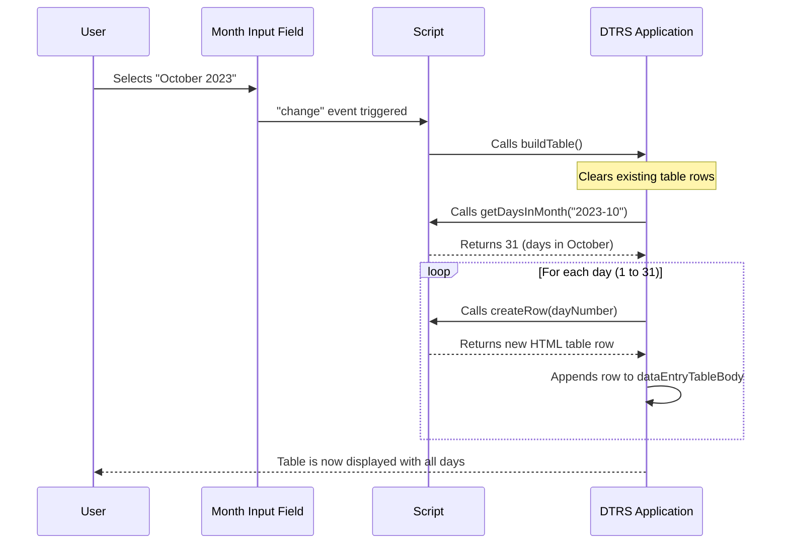

# Chapter 1: Dynamic DTR Table & Row Management

Imagine you have a monthly attendance sheet, like a big spreadsheet. Every single day, you need to write down when you arrived, when you left for lunch, came back, and then left for the day. If it's a weekend, you mark it. If it's a holiday, you mark that too. What if your work schedule changes? Or what if you make a mistake and need to adjust a time? Suddenly, you have to recalculate everything, especially if there's any "undertime" to account for! It sounds like a lot of manual work, right?

This is exactly the problem **Dynamic DTR Table & Row Management** solves! Think of it as your personal, automated spreadsheet manager for daily attendance. It takes away all the tedious manual tasks, making sure your daily time record (DTR) is always accurate and easy to fill out.

## The Tedious Manual Way vs. The Automated Way

Before we dive in, let's quickly see the difference:

| Feature           | Manual Way                                      | Automated Way (DTRS)                                    |
| :---------------- | :---------------------------------------------- | :------------------------------------------------------ |
| **Table Setup**   | Draw rows for each day, write dates manually.   | Select month, table auto-generates with all days.       |
| **Day Types**     | Manually check calendar for weekends/holidays.  | Automatically labels days as 'normal', 'weekend', 'holiday'. |
| **Time Entry**    | Write times by hand.                            | Type times into smart input fields.                     |
| **Calculations**  | Use a calculator for undertime/total hours.     | Automatic recalculation of undertime as you type.       |
| **Updates**       | Erase, rewrite, recalculate.                    | Edit time, undertime instantly updates.                 |

Clearly, the automated way saves a lot of time and reduces errors!

## Automated Table Generation: Your Monthly DTR at a Click

Let's imagine you need to fill out your DTR for **October 2023**. Instead of manually drawing a 31-day table, the `DTRS` project does it for you.

### Step 1: Selecting a Month

First, you tell the system which month you're interested in. You'll see a simple input field for this:

**Input Example (from `index.html`):**

```html
<label>
  Month / Year:
  <input id="reportMonth" type="month" />
</label>
```

When you choose "October 2023" from this input, the system springs into action.

### Step 2: Building the Table

The moment you select a month, or if the page loads for the first time, the `buildTable()` function gets called. This function is like the architect that draws the entire attendance table for the selected month.

**What `buildTable()` Does:**

1.  **Clears Old Data**: It first makes sure any old rows from previous months are removed from the table.
2.  **Finds Days in Month**: It figures out how many days are in the selected month (e.g., 31 for October).
3.  **Creates Each Row**: For each day, it calls another special function, `createRow()`, to build a new row with all the necessary input fields.
4.  **Adds to Table**: Finally, it adds this newly created row to the main attendance table on your screen.

Here's a simplified look at the HTML structure where these rows are added:

**HTML Table Body (from `index.html`):**

```html
<table id="dataEntryTable">
  <thead>
    <!-- Table Headers go here -->
  </thead>
  <tbody>
    <!-- This is where our daily rows will be added! -->
  </tbody>
</table>
```

### How It Works: Behind the Scenes of Table Generation

Let's peek under the hood to see how the system generates these rows.

#### Getting Days in a Month

The `getDaysInMonth()` function is crucial here. It takes your selected month (like "2023-10" for October 2023) and tells the system that October has 31 days.

```javascript
// A super simplified version of getDaysInMonth function
function getDaysInMonth(monthYearString) {
  if (!monthYearString) {
    const today = new Date();
    // Default to current month if no month is selected
    return new Date(today.getFullYear(), today.getMonth() + 1, 0).getDate();
  }
  const [year, month] = monthYearString.split('-').map(Number);
  // Date(year, month, 0) gives the last day of the *previous* month.
  // So, Date(year, month, 0) for month=10 (October) gives Sept 30.
  // To get Oct 31, we need Date(year, month+1, 0) -> Nov 0 -> Oct 31.
  return new Date(year, month, 0).getDate();
}
```
**Explanation:**
This function simply uses JavaScript's `Date` object tricks. If you ask for `new Date(YEAR, MONTH, 0)`, it gives you the last day of the *previous* month. So, if we want the days in October (month `10`), we ask for `new Date(2023, 11, 0)` which actually gives us the last day of November, which is `October 31`. This is a common pattern in JavaScript for getting the number of days in a month.

#### Creating Each Row

Once `buildTable()` knows how many days there are, it loops through each day and calls `createRow(dayNumber)`. This `createRow()` function is responsible for building the actual HTML for one day's entry in the table.

**What `createRow(dayNumber)` Builds (Simplified):**

```html
<!-- Example of one row for Day 1 -->
<tr>
  <td>
    <!-- Dropdown to select day type (Normal, Weekend, Holiday) -->
    <select class="day-type-select" data-field="dayType">
      <option value="normal">Normal</option>
      <option value="weekend">Weekend</option>
      <option value="holiday">Holiday</option>
      <option value="restday">Rest Day</option>
    </select>
  </td>
  <td>1</td> <!-- The day number -->
  <td><input type="time" class="table-input" data-field="amArrival" /></td>
  <td><input type="time" class="table-input" data-field="amDeparture" /></td>
  <td><input type="time" class="table-input" data-field="pmArrival" /></td>
  <td><input type="time" class="table-input" data-field="pmDeparture" /></td>
  <td><input type="text" class="table-input" data-field="underTimeHours" disabled /></td>
  <td><input type="text" class="table-input" data-field="underTimeMinutes" disabled /></td>
</tr>
```

Each row contains:
*   A `select` box for the **Day Type** (Normal, Weekend, Holiday, Rest Day).
*   The **Day Number**.
*   Input fields for **AM Arrival**, **AM Departure**, **PM Arrival**, and **PM Departure** times.
*   Display fields for **Undertime Hours** and **Undertime Minutes**, which are automatically calculated and cannot be manually edited (`disabled`).

#### Sequence of Table Generation

Here's how these functions work together when you select a month:



## Smart Day Types: Knowing Your Weekends and Holidays

Wouldn't it be great if the system already knew if a day was a weekend or a holiday? `DTRS` does exactly that! The `getDefaultDayType(dayNumber)` function automatically tries to figure out what type of day it is:

*   **Weekend**: If the day falls on a Saturday or Sunday.
*   **Holiday**: If the day is officially declared a holiday (fetched from an online source, more on this in [Holiday Integration](04_holiday_integration_.md)).
*   **Normal**: Any other day.

```javascript
// A super simplified version of getDefaultDayType function
function getDefaultDayType(dayNumber) {
  const [year, month] = reportMonth.value.split('-').map(Number);
  if (!year || !month) return 'normal'; // Default if month isn't set

  // Check for holidays (details deferred to Holiday Integration chapter)
  if (getHolidayName(dayNumber)) {
    return 'holiday';
  }

  const date = new Date(year, month - 1, dayNumber); // month is 0-indexed
  const dayOfWeek = date.getDay(); // 0 for Sunday, 6 for Saturday

  if (dayOfWeek === 0) return 'sunday';
  if (dayOfWeek === 6) return 'saturday';
  return 'normal';
}
```
**Explanation:**
This function looks at the `dayNumber` and the selected `reportMonth`. It creates a `Date` object for that specific day. Then, it checks:
1.  Is there a holiday for this date? (This check uses `getHolidayName`, which relies on data fetched by the `fetchHolidays` function. We'll explore this more in [Holiday Integration](04_holiday_integration_.md)). If yes, it marks it as 'holiday'.
2.  Is it a Sunday (day `0`) or Saturday (day `6`)? If yes, it marks it as 'sunday' or 'saturday'.
3.  Otherwise, it's a 'normal' workday.

This determined day type is then automatically set in the "Type" dropdown for that row when `createRow()` builds it. You can still change it manually if needed, for instance, if a normal workday was a special non-working holiday not caught by the automatic fetch.

## Interactive Time Entry & Automatic Undertime Calculation

This is where the "dynamic" part really shines! The DTR table isn't just a static display; it's interactive.

### Inputting Your Times

Each day's row has input fields where you can enter your actual arrival and departure times.

**Example Input Field (from `index.html`):**

```html
<input type="time" class="table-input" data-field="amArrival" />
```

As you type or select times in these fields, something smart happens in the background.

### The Magic of Recalculation

The system automatically recalculates your "undertime" (or any other derived calculation) as soon as you change any time entry or even your official schedule. This is managed by an event listener attached to these input fields, and to the official schedule dropdowns.

When you modify a time, a function (often named `_3e3e67()` in the provided code, or similar in a cleaner version) is triggered for that specific row. This function:

1.  **Reads Times**: Gathers all entered times for the day (AM Arrival, AM Departure, PM Arrival, PM Departure).
2.  **Reads Official Schedule**: Checks the "Official hours" settings for regular days or Saturdays. (More details on parsing schedules in [Time and Schedule Processing](03_time_and_schedule_processing_.md)).
3.  **Performs Calculations**: Compares your entered times against the official schedule and calculates any undertime.
4.  **Updates Display**: Fills in the "Undertime Hours" and "Undertime Minutes" fields for that row.

```javascript
// A simplified version of the recalculation logic within createRow (represented as _3e3e67)
// This logic is attached to the 'input' and 'change' events of the time fields.
const _3e3e67 = () => {
  // ... (code to get entered times and official schedule) ...

  if (dayType === 'holiday' || dayType === 'sunday' || dayType === 'saturday' /* etc */) {
    // If it's a non-working day, clear undertime fields
    underTimeHoursField.value = '';
    underTimeMinutesField.value = '';
    // Optionally disable time input fields for non-working days
    timeInputs.forEach(input => input.disabled = true);
    return;
  }

  // ... (code to parse times, calculate expected working minutes, actual working minutes) ...

  let actualWorkingMinutes = 0; // Simplified
  // Based on amArrival, amDeparture, pmArrival, pmDeparture
  // and considering lunch break duration from official schedule.

  const expectedMinutes = getExpectedMinutesForDay(dayNumber);

  if (expectedMinutes !== null) {
    if (actualWorkingMinutes < expectedMinutes) {
      const undertimeTotalMinutes = expectedMinutes - actualWorkingMinutes;
      underTimeHoursField.value = Math.floor(undertimeTotalMinutes / 60);
      underTimeMinutesField.value = pad(undertimeTotalMinutes % 60);
    } else {
      underTimeHoursField.value = '';
      underTimeMinutesField.value = '';
    }
  } else {
    // If no schedule set, or invalid, clear undertime
    underTimeHoursField.value = '';
    underTimeMinutesField.value = '';
  }
};
// This function (_3e3e67) is then added as an event listener
// to each time input field in the row.
// Example: someInputField.addEventListener('change', _3e3e67);
```

**Explanation:**
This snippet shows the core idea: when times are changed, the `_3e3e67()` function (or similar logic) is called. It first checks the `dayType` to see if it's a day where undertime should even be calculated. Then, it attempts to calculate `actualWorkingMinutes` (how long you actually worked) and `expectedMinutes` (how long you *should* have worked based on your schedule). If `actualWorkingMinutes` is less than `expectedMinutes`, it calculates the difference and updates the `undertimeHours` and `undertimeMinutes` fields.

The detailed logic for parsing time strings and calculating working minutes is covered in depth in the [Time and Schedule Processing](03_time_and_schedule_processing_.md) chapter. For now, just understand that these calculations happen automatically and instantly!

## Conclusion

In this first chapter, we've explored the core concept of **Dynamic DTR Table & Row Management**. We learned how the system:

*   Automatically generates a complete monthly attendance table, saving you from manual setup.
*   Intelligently assigns default day types like 'normal', 'weekend', and 'holiday' for each day.
*   Provides interactive input fields for time entries.
*   Dynamically recalculates undertime as soon as you update any time or schedule, keeping your records accurate without extra effort.

This dynamic management is the foundation of the `DTRS` project, making your daily time recording experience smooth and efficient.

Next, we'll dive deeper into how this system stores and manages all the attendance information behind the scenes, looking at the **DTR Core Data Model**.

[Next Chapter: DTR Core Data Model](02_dtr_core_data_model_.md)

---

<sub><sup>Generated by [AI Codebase Knowledge Builder](https://github.com/The-Pocket/Tutorial-Codebase-Knowledge).</sup></sub> <sub><sup>**References**: [[1]](https://github.com/nekofied143/DTRS/blob/e3a6c0dc4801d2e79c08c2b98cc6ce7241bd05b8/index.html), [[2]](https://github.com/nekofied143/DTRS/blob/e3a6c0dc4801d2e79c08c2b98cc6ce7241bd05b8/script.js), [[3]](https://github.com/nekofied143/DTRS/blob/e3a6c0dc4801d2e79c08c2b98cc6ce7241bd05b8/styles.css)</sup></sub>
