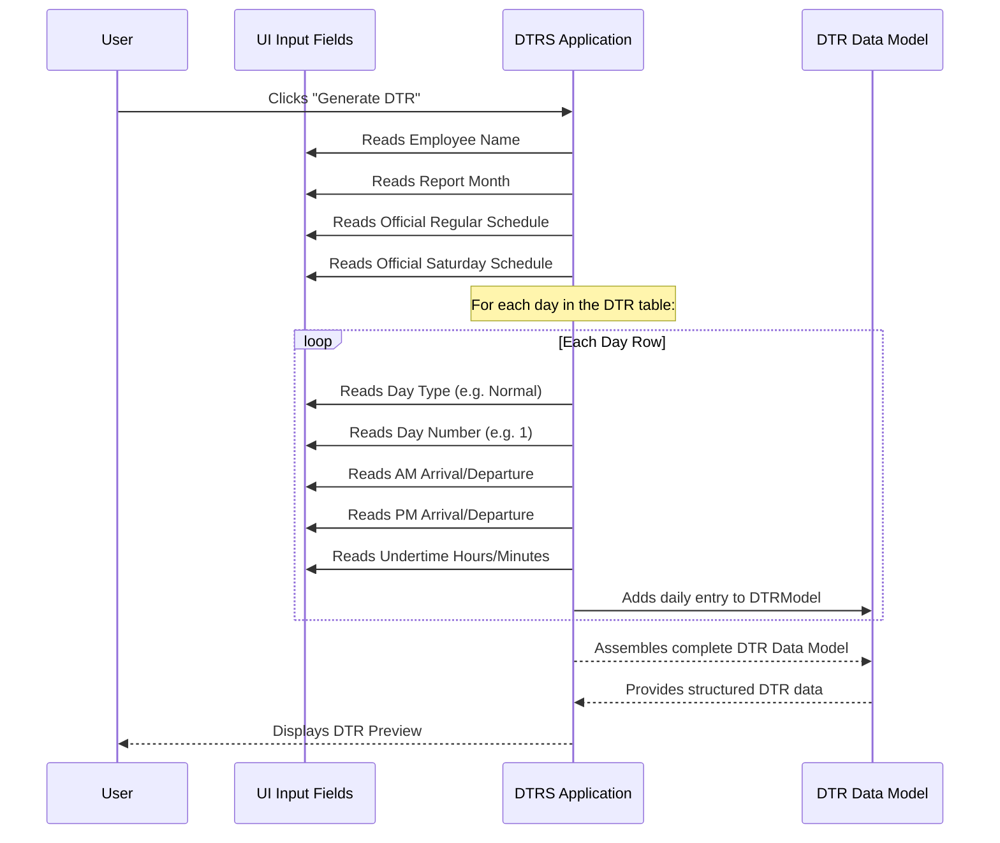

# Chapter 2: DTR Core Data Model

In [Chapter 1: Dynamic DTR Table & Row Management](01_dynamic_dtr_table___row_management_.md), we learned how the `DTRS` project makes it easy to create and manage your daily attendance table dynamically. You saw how the system automatically generates rows for each day, guesses the day type (weekend/holiday), and even calculates undertime as you type. That's a lot of information being displayed and managed!

But where does all that information *go*? How does the `DTRS` project keep track of your name, the month you're reporting for, your official work hours, and every single time entry for every day? If you close the application and reopen it, how can it remember all your entries?

This is where the **DTR Core Data Model** comes into play. Think of it as the **blueprint** for your entire Daily Time Record. Just like a house needs a blueprint to define its rooms, walls, and foundation, your DTR needs a clear structure to define all the pieces of information it contains and how they relate to each other. Without this blueprint, it would be a chaotic mess of numbers and dates!

## What is a Data Model, Anyway?

In simple terms, a **data model** is like a structured way of organizing information. It answers questions such as:

*   What pieces of information do we need to store?
*   What kind of data is each piece (e.g., text, number, date, time)?
*   How are different pieces of information related?

For our `DTRS` project, the core problem the data model solves is holding **all necessary information for one complete monthly DTR report** in an organized way.

## The Blueprint for Your DTR: Key Components

Let's look at the main parts of this "DTR blueprint." The `DTRS` project needs to store several categories of information to make a complete DTR:

| Component Category      | What it Represents                                   | Example Data                               |
| :---------------------- | :--------------------------------------------------- | :----------------------------------------- |
| **Employee Information** | Who is this DTR for?                                 | Name: "Jane Doe"                           |
| **Reporting Period**     | Which month and year is this DTR covering?           | Month: "October 2023"                      |
| **Official Schedules**   | What are the standard work hours?                    | Regular Day: 8:00 AM - 5:00 PM (with 1hr lunch) |
| **Daily Entries**        | Specific attendance details for *each* day.          | Day 1: AM In, AM Out, PM In, PM Out, Undertime |

Let's break down how each of these categories is represented.

### 1. Employee Information

This is straightforward. We need to know whose DTR this is.

**Where it comes from in the UI:**
You input this in the "Name" field at the top of the application.

**Example Input (from `index.html`):**

```html
<label>
  Name:
  <input id="employeeName" type="text" placeholder="Employee name" />
</label>
```

The data model will simply store the text you enter here.

### 2. Reporting Period (Month/Year)

Every DTR is for a specific month and year.

**Where it comes from in the UI:**
You select this using the "Month / Year" input field.

**Example Input (from `index.html`):**

```html
<label>
  Month / Year:
  <input id="reportMonth" type="month" />
</label>
```

This will be stored as a string, like "2023-10" for October 2023.

### 3. Official Schedules

These are your standard working hours, which are crucial for calculating undertime. The `DTRS` project needs to know your regular working hours and potentially different hours for Saturdays.

**Where it comes from in the UI:**
You select these from dropdown menus labeled "Official hours for arrival/departure (Regular days)" and "(Saturdays)".

**Example Input (from `index.html`):**

```html
<select id="officialHoursRegularStart">
  <option value="08:00-17:00-60">8:00 AM - 5:00 PM (8 hrs + 1hr lunch)</option>
  <!-- ... other options ... -->
</select>
```

Notice the `value="08:00-17:00-60"`. This single string contains three pieces of information: `start time - end time - lunch break minutes`. The data model will store these structured values.

### 4. Daily Entries

This is the most detailed part of the data model. For *each* day of the month, we need to store:

*   The day number (e.g., 1, 2, 3...).
*   The type of day (e.g., "normal", "weekend", "holiday", "restday").
*   Your AM arrival time.
*   Your AM departure time.
*   Your PM arrival time.
*   Your PM departure time.
*   The calculated undertime (hours and minutes).

**Where it comes from in the UI:**
Each row in the dynamic DTR table you saw in Chapter 1 represents one of these daily entries.

**Example Row (simplified HTML from `createRow` function in `script.js`):**

```html
<tr>
  <td><select class="day-type-select" data-field="dayType">...</select></td>
  <td>1</td> <!-- Day number -->
  <td><input type="time" data-field="amArrival" /></td>
  <td><input type="time" data-field="amDeparture" /></td>
  <td><input type="time" data-field="pmArrival" /></td>
  <td><input type="time" data-field="pmDeparture" /></td>
  <td><input type="text" data-field="underTimeHours" disabled /></td>
  <td><input type="text" data-field="underTimeMinutes" disabled /></td>
</tr>
```

Each `data-field` attribute helps the system identify which piece of information belongs to which part of the daily entry.

## How DTRS Builds the Complete DTR Data Model

When you click the "Generate DTR" button, the `DTRS` project collects all these pieces of information from the different input fields and organizes them into a single, comprehensive data model.

Imagine all these separate input fields are like individual notes on your desk. The "Generate DTR" button is like someone coming along, reading all your notes, and putting them into a neatly organized folder, labeling each piece of information. This organized folder is our DTR data model!

Let's see how the application gathers this data:



### Under the Hood: Structuring the Data

In JavaScript, this "structured folder" (our data model) is typically represented as a large object, containing smaller objects and arrays.

Here's a simplified look at how the `DTRS` project might assemble this data model when you click "Generate DTR" (from the `buildRecordPreview` function in `script.js`).

```javascript
// A conceptual structure of the DTR Data Model being built
let completeDTRData = {
  employee: {
    name: employeeName.value.trim() // Get employee name from input field
  },
  monthYear: reportMonth.value, // Get selected month/year
  officialSchedules: {
    // Parse the value from the select dropdowns
    regular: parseScheduleValue(officialHoursRegularStart.value),
    saturday: parseScheduleValue(officialHoursSatStart.value)
  },
  dailyEntries: [] // An empty list to hold each day's entry
};

// Now, loop through each row in the table to get daily entries
const tableRows = Array.from(dataEntryTableBody.querySelectorAll('tr'));

tableRows.forEach(row => {
  const dayData = {
    day: parseInt(row.querySelector('[data-field="dayNumber"]').textContent),
    dayType: row.querySelector('[data-field="dayType"]').value,
    amArrival: row.querySelector('[data-field="amArrival"]').value,
    amDeparture: row.querySelector('[data-field="amDeparture"]').value,
    pmArrival: row.querySelector('[data-field="pmArrival"]').value,
    pmDeparture: row.querySelector('[data-field="pmDeparture"]').value,
    underTimeHours: row.querySelector('[data-field="underTimeHours"]').value,
    underTimeMinutes: row.querySelector('[data-field="underTimeMinutes"]').value
  };
  completeDTRData.dailyEntries.push(dayData); // Add each day's data to the list
});

// The completeDTRData object now holds the entire DTR Data Model!
```

**Explanation:**
1.  We start by creating a `completeDTRData` object. This is our main "folder".
2.  We fill in the `employee.name` and `monthYear` directly from the input fields.
3.  For `officialSchedules`, we use the `parseScheduleValue` function (which we briefly saw in Chapter 1) to convert the "08:00-17:00-60" string into a more usable object like `{ start: 480, end: 1020, lunchBreakMinutes: 60 }` (times in minutes from midnight).
4.  Then, we go through `each table row` (which represents a day) using `Array.from` and `forEach`.
5.  For each row, we create a `dayData` object and read all the values from its specific input fields using `querySelector` and the `data-field` attributes.
6.  Finally, we add this `dayData` object to the `dailyEntries` list within our `completeDTRData`.

After this process, the `completeDTRData` object is a perfectly organized representation of your entire DTR. This structured data is then easy to use for displaying a preview, saving to a file, or generating a report.

The beauty of this data model is that once all the information is collected and organized, it can be easily stored, retrieved, and processed. For instance, when you want to save your DTR to a CSV file (which we'll cover later in [File Input/Output (CSV)](06_file_input_output__csv__.md)), the system just needs to convert this structured `completeDTRData` object into the CSV format.

## Conclusion

In this chapter, we've explored the **DTR Core Data Model**, understanding it as the essential blueprint that structures all the information needed for a complete Daily Time Record. We learned about its key components: employee details, reporting month, official schedules, and individual daily entries. By organizing all this data into a clear model, `DTRS` can efficiently manage, process, and display your attendance records.

With a solid understanding of how DTR data is structured, we're now ready to dive into how the system interprets and processes all those time entries and schedules.

[Next Chapter: Time and Schedule Processing](03_time_and_schedule_processing_.md)

---

<sub><sup>Generated by [AI Codebase Knowledge Builder](https://github.com/The-Pocket/Tutorial-Codebase-Knowledge).</sup></sub> <sub><sup>**References**: [[1]](https://github.com/nekofied143/DTRS/blob/e3a6c0dc4801d2e79c08c2b98cc6ce7241bd05b8/index.html), [[2]](https://github.com/nekofied143/DTRS/blob/e3a6c0dc4801d2e79c08c2b98cc6ce7241bd05b8/script.js)</sup></sub>
