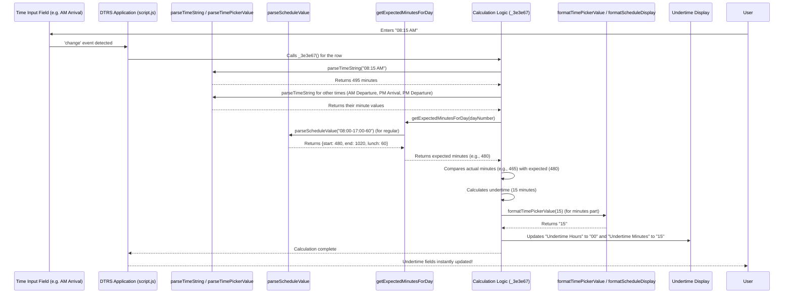

# Chapter 3: Time and Schedule Processing

In [Chapter 2: DTR Core Data Model](02_dtr_core_data_model_.md), we learned how `DTRS` organizes all the information for your daily time record, like your name, the month, and especially your daily time entries and official work schedules. We have the blueprint of our data, but how does the system *understand* all the different ways we write time?

Think about it:
*   You might type "8:00 AM" for your arrival.
*   Your official schedule might be listed as "08:00-17:00-60".
*   If you're late, the system needs to calculate how much "undertime" you have.
*   Finally, it needs to show all these times and calculations in a clear, easy-to-read format like "08:00 AM" or "09:00 PM".

Computers are great at numbers, but they don't inherently understand human-friendly time formats like "8:00 AM" or "5:00 PM" when they need to perform calculations. They need a single, consistent way to represent time for easy arithmetic. This is exactly what **Time and Schedule Processing** solves!

It's like a universal translator for time. It takes all the different ways you express time and converts them into a secret, standardized numerical language that the computer understands for calculations. Then, it translates that numerical language back into human-readable formats for you to see.

## The Problem: Different Time "Languages"

Let's look at the challenge:

| Human-Friendly Time | What the Computer Needs (for calculations) | Why?                                   |
| :------------------ | :----------------------------------------- | :------------------------------------- |
| "8:00 AM"           | "480" (minutes from midnight)              | Easy to add, subtract, compare.        |
| "5:00 PM"           | "1020" (minutes from midnight)             | (17 * 60) + 0 = 1020                   |
| "08:00-17:00-60"    | Start: 480, End: 1020, Lunch: 60           | Represents a full work schedule in a calculable way. |

Without a standardized number, calculating things like "total hours worked" or "undertime" would be very messy!

## How DTRS Translates Time: Key Concepts

The `DTRS` project uses a simple but powerful strategy:
1.  **Standardized Unit**: All times are converted into **total minutes from midnight**. For example, 1:00 AM is 60 minutes, 1:00 PM is 780 minutes (13 * 60).
2.  **Parsing**: Functions are used to "read" different time formats and convert them into this standardized minute number.
3.  **Calculation**: Once everything is in minutes, simple addition and subtraction can be done.
4.  **Formatting**: Functions convert the minute numbers back into human-readable time strings for display.

## Use Case: Calculating Undertime Automatically

Let's revisit the automatic undertime calculation you briefly saw in [Chapter 1: Dynamic DTR Table & Row Management](01_dynamic_dtr_table___row_management_.md). When you type your "AM Arrival" time, how does the system figure out your undertime?

Here's the step-by-step process, enabled by time and schedule processing:

1.  **Input Captured**: You type "08:15 AM" into the "AM Arrival" field.
2.  **Standardize Your Input**: The system uses a "time parser" to convert "08:15 AM" into `495` minutes (8 * 60 + 15). It does this for all your AM/PM arrival/departure times.
3.  **Standardize Official Schedule**: It takes your selected official schedule (e.g., "08:00-17:00-60") and uses a "schedule parser" to convert it into a structured object: `{ start: 480, end: 1020, lunchBreakMinutes: 60 }`.
4.  **Calculate Expected Work**: It calculates that for a regular day, you're expected to work `(1020 - 480) - 60 = 480 minutes` (8 hours).
5.  **Calculate Actual Work**: It compares your parsed arrival/departure times against each other to figure out your total actual working minutes for the day (e.g., `(AM Departure - AM Arrival) + (PM Departure - PM Arrival) - Lunch`).
6.  **Compare & Determine Undertime**: If your `actual working minutes` are less than `expected working minutes`, it calculates the difference.
7.  **Format for Display**: The difference (e.g., `15 minutes`) is then converted back into a human-readable format, "00 hours 15 minutes", and displayed in the "Undertime" fields.

This entire process happens instantly every time you change a time!

## Under the Hood: The Time Translator at Work

Let's look at the core functions that act as our time translators.

### 1. Ensuring Two Digits: `pad()`

Before we dive into time parsing, there's a small helper function, `pad()`, that ensures numbers always have two digits (e.g., 5 becomes 05). This is super useful for consistent time displays.

```javascript
// From script.js (simplified)
function pad(number) {
  // Converts a number to a string and adds a '0' in front if it's a single digit.
  // Then, it takes the last two characters.
  return String(number).padStart(2, '0');
}
```

**Explanation:**
If `number` is `5`, `String(number)` becomes `"5"`. `padStart(2, '0')` makes it `"05"`. If `number` is `12`, it remains `"12"`.

### 2. Translating Time Strings to Minutes: `parseTimeString()` and `parseTimePickerValue()`

These functions are the heart of our input translation. They take time strings like "8:00 AM" or "14:30" and convert them into a single number representing minutes from midnight.

```javascript
// From script.js (simplified for clarity)
function parseTimeString(timeString) {
  if (!timeString) return null; // If nothing is entered, return nothing

  const cleanedString = timeString.trim(); // Remove any extra spaces

  // Try to match "HH:MM AM/PM" format
  const ampmMatch = cleanedString.match(/^(\d{1,2}):(\d{2})\s*(am|pm)$/i);
  if (ampmMatch) {
    let hours = Number(ampmMatch[1]); // e.g., 8
    const minutes = Number(ampmMatch[2]); // e.g., 00
    const ampm = ampmMatch[3].toLowerCase(); // e.g., "am" or "pm"

    if (ampm === 'pm' && hours !== 12) hours += 12; // Convert PM hours to 24-hour format
    if (ampm === 'am' && hours === 12) hours = 0;   // 12 AM (midnight) is 0 hours

    return hours * 60 + minutes; // Total minutes from midnight
  }

  // Try to match "HH:MM" (24-hour) format
  const militaryMatch = cleanedString.match(/^(\d{1,2}):(\d{2})$/);
  if (militaryMatch) {
    const hours = Number(militaryMatch[1]);
    const minutes = Number(militaryMatch[2]);
    return hours * 60 + minutes;
  }

  return null; // If no format matched, it's invalid
}

function parseTimePickerValue(timeString) {
  // This is a simpler version, expecting only "HH:MM" (24-hour) format,
  // typically from HTML <input type="time"> elements.
  if (!timeString) return null;
  const match = timeString.match(/^(\d{1,2}):(\d{2})$/);
  if (match) {
    const hours = Number(match[1]);
    const minutes = Number(match[2]);
    return hours * 60 + minutes;
  }
  return null;
}
```

**Explanation:**
*   `parseTimeString` is versatile, handling "AM/PM" and 24-hour formats. It uses regular expressions (`.match()`) to identify the hours, minutes, and AM/PM part. Then, it converts the hours to a 24-hour format and calculates the total minutes from midnight.
    *   Example: `parseTimeString("8:15 AM")` -> `(8 * 60) + 15 = 495`
    *   Example: `parseTimeString("5:00 PM")` -> `(17 * 60) + 0 = 1020`
    *   Example: `parseTimeString("14:30")` -> `(14 * 60) + 30 = 870`
*   `parseTimePickerValue` is specifically designed for the standard `HH:MM` output of an HTML `<input type="time">`. It's a bit simpler because it doesn't need to deal with AM/PM.

### 3. Translating Schedule Strings: `parseScheduleValue()`

This function is specialized for handling our unique schedule format (e.g., "08:00-17:00-60"). It uses `parseTimePickerValue()` internally.

```javascript
// From script.js (simplified)
function parseScheduleValue(scheduleString) {
  if (!scheduleString) return null;

  const parts = scheduleString.split('-'); // Split the string by '-'
  if (parts.length !== 3) return null; // Expect 3 parts: start, end, lunch

  // Use parseTimePickerValue to convert time parts to minutes
  const startTimeMinutes = parseTimePickerValue(parts[0]); // "08:00" -> 480
  const endTimeMinutes = parseTimePickerValue(parts[1]);   // "17:00" -> 1020
  const lunchBreakMinutes = Number(parts[2]);              // "60" -> 60

  if (startTimeMinutes === null || endTimeMinutes === null || isNaN(lunchBreakMinutes)) {
    return null; // If any part is invalid, the whole schedule is invalid
  }

  return {
    start: startTimeMinutes,
    end: endTimeMinutes,
    lunchBreakMinutes: lunchBreakMinutes
  };
}
```

**Explanation:**
*   It takes a string like "08:00-17:00-60".
*   It splits the string into `["08:00", "17:00", "60"]`.
*   It then calls `parseTimePickerValue` for the start and end times to convert them to minutes.
*   The lunch break is directly converted to a number.
*   Finally, it returns an object that's easy to work with: `{ start: 480, end: 1020, lunchBreakMinutes: 60 }`. This structured data is part of the [DTR Core Data Model](02_dtr_core_data_model_.md)!

### 4. Calculating Expected Work Minutes: `getExpectedMinutesForDay()`

This function uses the parsed schedule values to determine how many minutes an employee is *expected* to work on a given day.

```javascript
// From script.js (simplified)
function getExpectedMinutesForDay(dayNumber) {
  // Get the selected month and year
  const [year, month] = reportMonth.value.split('-').map(Number);
  if (!year || !month) return null;

  // Create a Date object for the specific day to check if it's a Saturday
  const date = new Date(year, month - 1, dayNumber); // Month is 0-indexed

  // Parse the regular and Saturday official schedules from the UI
  const regularSchedule = parseScheduleValue(officialHoursRegularStart.value);
  const saturdaySchedule = parseScheduleValue(officialHoursSatStart.value);

  // If it's a Saturday AND we have a Saturday schedule defined
  if (date.getDay() === 6 && saturdaySchedule) { // 6 is Saturday
    // Calculate expected minutes: (end - start) - lunch
    const expected = saturdaySchedule.end - saturdaySchedule.start - saturdaySchedule.lunchBreakMinutes;
    return expected >= 0 ? expected : null; // Ensure non-negative
  }

  // For any other day (or if no Saturday schedule), use the regular schedule
  if (regularSchedule) {
    const expected = regularSchedule.end - regularSchedule.start - regularSchedule.lunchBreakMinutes;
    return expected >= 0 ? expected : null;
  }

  return null; // No valid schedule found for the day
}
```

**Explanation:**
*   This function first determines if the `dayNumber` falls on a Saturday.
*   It then retrieves and `parseScheduleValue` for both regular and Saturday schedules from the user interface.
*   Based on whether it's a Saturday and if a specific Saturday schedule exists, it calculates the `(end - start) - lunch` minutes. This gives the total expected working minutes for that day.

### 5. Translating Minutes Back to Time Strings: `formatTimePickerValue()` and `formatScheduleDisplay()`

These are the reverse translators, taking our minute numbers and converting them back to human-readable time.

```javascript
// From script.js (simplified)
function formatTimePickerValue(totalMinutes) {
  if (totalMinutes === null || totalMinutes === '') return ''; // Handle empty input

  // Convert total minutes back to hours and minutes
  const hours = Math.floor(totalMinutes / 60);
  const minutes = totalMinutes % 60;

  let ampm = "AM";
  let displayHours = hours;

  if (hours >= 12) { // 12 PM onwards is PM
    ampm = "PM";
    if (hours > 12) {
      displayHours = hours - 12; // Convert 13 to 1 PM, 14 to 2 PM, etc.
    }
  }
  if (hours === 0) { // 0 hours (midnight) is 12 AM
    displayHours = 12;
  }

  return displayHours + ':' + pad(minutes) + ' ' + ampm;
}

function formatScheduleDisplay(scheduleString) {
  // This function takes the raw "08:00-17:00-60" string
  // and formats it into "08:00 AM - 05:00 PM".
  const schedule = parseScheduleValue(scheduleString); // First, parse it!
  if (!schedule) return '';

  // Now, format the start and end times back to display strings
  const formattedStart = formatTimePickerValue(schedule.start);
  const formattedEnd = formatTimePickerValue(schedule.end);

  return formattedStart + ' - ' + formattedEnd;
}
```

**Explanation:**
*   `formatTimePickerValue` takes total minutes (e.g., `495`) and converts it back to "08:15 AM". It handles the 12-hour AM/PM conversion and uses `pad()` for minutes.
*   `formatScheduleDisplay` first *parses* the complex schedule string using `parseScheduleValue` to get the start/end minutes. Then, it uses `formatTimePickerValue` for each of those to create a display string like "08:00 AM - 05:00 PM".

### Putting It All Together: The Recalculation Flow

The `_3e3e67` function (or similar logic in a clean codebase) from Chapter 1 is the orchestrator that uses all these translator functions.



**Explanation:**
This diagram shows how `_3e3e67` (our `UndertimeCalculator`) acts as the conductor. It gathers all the necessary raw time and schedule strings, sends them to the appropriate `Parser` functions to be translated into standardized minutes, performs its core comparison and calculation, and then sends the final result to `TimeFormatter` to be translated back for display on the screen. This ensures all calculations are done efficiently and accurately.

## Conclusion

In this chapter, we unpacked the crucial concept of **Time and Schedule Processing**. We learned why standardizing time and schedule formats is essential for computers to perform calculations accurately. We explored how the `DTRS` project uses a set of "translator" functions like `parseTimeString()`, `parseScheduleValue()`, and `formatTimePickerValue()` to convert human-readable times into a common "minutes from midnight" format for processing, and then back again for display. This invisible translation layer makes the dynamic and automatic calculations in `DTRS` possible and incredibly user-friendly.

Next, we'll look at another piece of dynamic data: how `DTRS` knows about official holidays to further automate your DTR.

[Next Chapter: Holiday Integration](04_holiday_integration_.md)

---

<sub><sup>Generated by [AI Codebase Knowledge Builder](https://github.com/The-Pocket/Tutorial-Codebase-Knowledge).</sup></sub> <sub><sup>**References**: [[1]](https://github.com/nekofied143/DTRS/blob/e3a6c0dc4801d2e79c08c2b98cc6ce7241bd05b8/script.js)</sup></sub>
