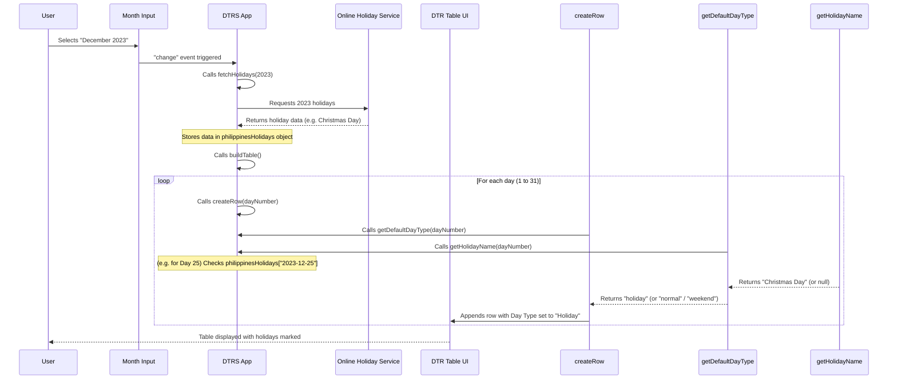

# Chapter 4: Holiday Integration

In [Chapter 3: Time and Schedule Processing](03_time_and_schedule_processing_.md), we learned how the `DTRS` project acts as a "time translator," converting your time entries and official schedules into a standardized format for accurate calculations. This is super helpful for knowing your actual work hours. But what about days when you're not expected to work at all?

Imagine you're filling out your DTR for December. You know Christmas Day is a holiday, and you shouldn't log any work hours or undertime for it. But what about other holidays? Do you have to Google "Philippine holidays 2023" every month and then manually mark each one in your DTR? That sounds like a lot of extra work, and it's easy to miss one!

This is exactly the problem **Holiday Integration** solves! It's like having a super-smart calendar built right into your DTR application. It automatically knows about official national holidays and flags them for you. This means your DTR will always accurately distinguish between regular workdays and non-working holidays, saving you from manual checks and potential errors.

## The Problem: Manual Holiday Tracking vs. Automated Integration

Let's look at the difference:

| Feature           | Manual Way                                          | Automated Way (DTRS)                                    |
| :---------------- | :-------------------------------------------------- | :------------------------------------------------------ |
| **Holiday ID**    | Manually search online for official holidays.       | Automatically fetches national holiday data.            |
| **Marking Days**  | Manually change day type in DTR table for each holiday. | Automatically sets day type to 'holiday' and can visually highlight it. |
| **Accuracy**      | Prone to human error (missing a holiday).           | Highly accurate, based on official data.                |
| **Effort**        | Time-consuming monthly task.                        | Zero effort after selecting the month.                  |

Clearly, the automated approach makes your life much easier and your DTR more accurate!

## How DTRS Knows About Holidays: Key Concepts

The `DTRS` project uses a few key steps to integrate holidays:

1.  **Fetching Holiday Data**: It reaches out to an online source (like a public holiday API) to get a list of official holidays for a specific year.
2.  **Storing Holidays**: It keeps this fetched list of holidays ready to be checked.
3.  **Identifying Holidays for Each Day**: When it builds your monthly DTR table, for each day, it checks if that day is on its stored holiday list.
4.  **Marking Holidays**: If a day is identified as a holiday, `DTRS` automatically sets its "Day Type" and can visually mark it in the table.

## Use Case: Automatically Marking December Holidays

Let's imagine you select **December 2023** in your `DTRS` application. Instead of you remembering that Christmas Day (Dec 25) and Rizal Day (Dec 30) are holidays, `DTRS` will:

1.  Automatically connect to an online service to get all 2023 holidays.
2.  When it generates the table for December, it will recognize December 25th and 30th as holidays.
3.  For those specific days, it will set their "Day Type" dropdown to "Holiday" and might even disable time input fields, as you're not expected to work.

## Under the Hood: The Holiday Finder at Work

Let's explore the functions that make this "holiday finder" work.

### 1. Fetching Holiday Data: `fetchHolidays(year)`

This is the first crucial step. When you select a month (e.g., December 2023), `DTRS` needs to know what the holidays are for that year (2023). The `fetchHolidays` function is responsible for making an online request to get this information.

**What `fetchHolidays()` Does:**

*   It takes the `year` as input.
*   It constructs a special web address (URL) for a public holiday API (like one for Philippine holidays).
*   It sends a request to this URL.
*   When it gets the data back, it processes it and stores it in a special object called `philippinesHolidays`.

**Simplified Code for `fetchHolidays` (from `script.js`):**

```javascript
let philippinesHolidays = {}; // This will store our fetched holidays

async function fetchHolidays(year) {
  try {
    // Imagine a public API that provides holidays
    const response = await fetch(`https://some-holiday-api.com/api/v1/holidays?country=PH&year=${year}`);

    if (response.ok) {
      const data = await response.json();
      // Process the data into a simple "YYYY-MM-DD": "Holiday Name" format
      philippinesHolidays = data.holidays.reduce((acc, holiday) => {
        acc[holiday.date] = holiday.name; // Example: "2023-12-25": "Christmas Day"
        return acc;
      }, {});
      buildTable(); // After fetching, rebuild the table to apply holidays
    }
  } catch (error) {
    console.error("Failed to fetch holidays:", error);
  }
}
```
**Explanation:**
1.  `philippinesHolidays = {}` is an empty object that will temporarily hold all holidays.
2.  The `fetchHolidays` function is `async` because it needs to wait for the internet request to complete.
3.  It builds a URL (e.g., `https://some-holiday-api.com/api/v1/holidays?country=PH&year=2023`).
4.  `await fetch(...)` sends the request and waits for the response.
5.  `response.ok` checks if the request was successful.
6.  `await response.json()` converts the received data into a JavaScript object.
7.  `data.holidays.reduce(...)` is a clever way to transform the list of holidays from the API into our easy-to-use `{"YYYY-MM-DD": "Holiday Name"}` format.
8.  Finally, `buildTable()` is called to regenerate the DTR table, ensuring the newly fetched holidays are applied to the days.

**When is `fetchHolidays` called?**
The system triggers `fetchHolidays()` whenever the `reportMonth` input field changes, ensuring that holidays for the selected year are always up-to-date.

### 2. Identifying a Holiday: `getHolidayName(dayNumber)`

Once the `philippinesHolidays` object is filled with data, `DTRS` needs a way to quickly check if a *specific* day is a holiday. This is where `getHolidayName` comes in.

**What `getHolidayName()` Does:**

*   It takes a `dayNumber` (e.g., `25` for the 25th of the month).
*   It combines this day number with the currently selected `reportMonth` (e.g., "2023-12") to create a full date string (e.g., "2023-12-25").
*   It then checks if this date string exists as a key in our `philippinesHolidays` object.
*   If it finds a match, it returns the holiday's name (e.g., "Christmas Day"); otherwise, it returns `null`.

**Simplified Code for `getHolidayName` (from `script.js`):**

```javascript
function getHolidayName(dayNumber) {
  // Get the selected year and month from the UI
  const [year, month] = reportMonth.value.split('-').map(Number);
  if (!year || !month) return null; // If no month is selected, no holidays

  // Create a date string like "2023-12-25"
  const dateString = `${year}-${pad(month)}-${pad(dayNumber)}`;

  // Check if this date exists in our fetched holidays
  // (philippinesHolidays was populated by fetchHolidays)
  return philippinesHolidays[dateString] || null;
}
```
**Explanation:**
1.  It retrieves the `year` and `month` from the `reportMonth` input.
2.  It constructs `dateString` using template literals and the `pad()` function (from [Chapter 3: Time and Schedule Processing](03_time_and_schedule_processing_.md)) to ensure single-digit months/days get a leading zero (e.g., `01` instead of `1`).
3.  It then simply tries to access `philippinesHolidays[dateString]`. If a holiday exists for that date, its name is returned. If not, `null` is returned.

### 3. Integrating with Day Type Selection: `getDefaultDayType(dayNumber)`

Remember the `getDefaultDayType` function from [Chapter 1: Dynamic DTR Table & Row Management](01_dynamic_dtr_table___row_management_.md)? This function is responsible for figuring out if a day is a 'normal' workday, 'weekend', or 'holiday'. Now, we can see how `getHolidayName` plugs right into it:

**Simplified `getDefaultDayType` (from `script.js`, extended from Chapter 1):**

```javascript
function getDefaultDayType(dayNumber) {
  const [year, month] = reportMonth.value.split('-').map(Number);
  if (!year || !month) return 'normal';

  // NEW: First, check if it's an official holiday!
  if (getHolidayName(dayNumber)) {
    return 'holiday'; // If it's a holiday, we're done!
  }

  // If not a holiday, then check for weekends (as seen in Chapter 1)
  const date = new Date(year, month - 1, dayNumber); // month is 0-indexed
  const dayOfWeek = date.getDay(); // 0 for Sunday, 6 for Saturday

  if (dayOfWeek === 0) return 'sunday';
  if (dayOfWeek === 6) return 'saturday';
  
  return 'normal'; // Otherwise, it's a normal workday
}
```
**Explanation:**
The updated `getDefaultDayType` function now prioritizes holiday detection. If `getHolidayName(dayNumber)` returns a holiday name (meaning it *is* a holiday), the function immediately returns `'holiday'`. Only if it's *not* a holiday does it proceed to check if it's a weekend. This ensures holidays are correctly identified and override weekend checks for days that might technically be a weekend *and* a holiday.

### Sequence of Holiday Integration

Here's how these functions work together when you interact with the DTR application:



## Conclusion

In this chapter, we explored **Holiday Integration**, a powerful feature that frees you from the tedious task of manually tracking official holidays. We learned how the `DTRS` project:

*   Automatically **fetches holiday data** from online sources.
*   **Identifies** whether a specific day is an official holiday using functions like `getHolidayName()`.
*   Seamlessly **integrates** this information into the existing `getDefaultDayType()` logic, ensuring your DTR table automatically marks holidays as they should be.

This automation ensures your DTR is not only accurate regarding work hours but also correctly categorizes non-working days. With a solid understanding of how holidays are handled, we are now ready to generate and preview a complete DTR report.

[Next Chapter: DTR Report Generation & Preview](05_dtr_report_generation___preview_.md)

---

<sub><sup>Generated by [AI Codebase Knowledge Builder](https://github.com/The-Pocket/Tutorial-Codebase-Knowledge).</sup></sub> <sub><sup>**References**: [[1]](https://github.com/nekofied143/DTRS/blob/e3a6c0dc4801d2e79c08c2b98cc6ce7241bd05b8/script.js)</sup></sub>
