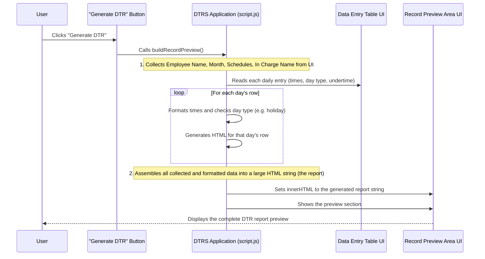

# Chapter 5: DTR Report Generation & Preview

In [Chapter 4: Holiday Integration](04_holiday_integration_.md), we perfected our DTR table. We now have an amazing system that automatically generates a monthly table, intelligently guesses day types (normal, weekend, holiday), calculates undertime, and even fetches official holidays. All your daily time records are neatly organized and calculated within the application.

But what do you do with all this perfectly organized data *inside* the app? You can see it on your screen, but how do you get a formal, print-ready document to submit to your office? You can't just take a screenshot! This is where **DTR Report Generation & Preview** comes in.

Imagine you're at the end of the month, and it's time to submit your Daily Time Record. Instead of manually copying all the entries onto a blank form, you want a button that magically produces an official-looking document, complete with your name, the month, all your times, and calculated undertimes, ready to be reviewed or printed. This chapter will show you how the `DTRS` project acts like a "document assembly line," taking all your processed data and turning it into a polished, print-ready report.

## The Problem: Raw Data vs. Official Document

Think about the difference between your neatly organized data inside the application and what an official DTR document looks like:

| Feature           | Data in `DTRS` Application                     | Official DTR Document                       |
| :---------------- | :--------------------------------------------- | :------------------------------------------ |
| **Format**        | Interactive table, input fields                | Static, formatted form layout               |
| **Purpose**       | Data entry, real-time calculation              | Review, official submission, printing       |
| **Appearance**    | Digital, dynamic                               | Standardized, print-friendly, professional  |
| **Effort**        | Input once                                     | No manual copying, just generate & print    |

The "Report Generation & Preview" feature bridges this gap, transforming the dynamic data into a static, presentable document.

## How DTRS Generates and Previews Your Report: Key Concepts

To turn your collected data into a report, `DTRS` follows a few key steps:

1.  **Data Assembly**: It collects *all* the final, processed data from everywhere in the application (your name, selected month, official schedules, and every single daily entry).
2.  **Report Templating**: It uses a predefined layout (like a blank DTR form) and fills it with your assembled data. This is often done by building a special HTML string.
3.  **Preview Display**: It shows you this generated report right on your screen, so you can check it before doing anything else.
4.  **Print Functionality**: It provides an easy way to send this preview to your printer, formatted for a standard paper size.

## Use Case: Generating Your Monthly DTR Report

Let's walk through how you would generate your DTR for **October 2023** after all your daily entries and schedules are complete.

### Step 1: Click the "Generate DTR" Button

Once you've finished inputting all your times for the month, you'll see a "Generate DTR" button in the application.

**Example Button (from `index.html`):**

```html
<button id="generateButton" type="button">Generate DTR</button>
```

When you click this, the magic begins!

### Step 2: DTRS Assembles the Report

Behind the scenes, the `DTRS` application collects all the data that's currently on your screen and in its internal memory (our [DTR Core Data Model](02_dtr_core_data_model_.md)). It gets:

*   Your employee name.
*   The month and year you selected.
*   Your chosen official work schedules.
*   Every single time entry (AM Arrival, AM Departure, PM Arrival, PM Departure) for each day.
*   The calculated undertime for each day.
*   The 'In Charge' name for signatures.

### Step 3: DTRS Creates and Displays the Preview

After collecting all the data, `DTRS` "draws" the DTR report using HTML. It's like taking a blank DTR form and filling it out perfectly, line by line. This generated HTML is then placed into a special "preview area" on your screen.

**Preview Area (from `index.html`):**

```html
<section class="preview-section">
  <div class="preview-header">
    <h2>Generated Daily Time Record</h2>
    <button id="printButton" type="button">Print</button>
  </div>
  <div id="recordPreview" class="record-preview"></div>
</section>
```

The `recordPreview` `div` is where your final, formatted DTR will appear! The `preview-section` (which is normally hidden) becomes visible, allowing you to see your complete report.

## Under the Hood: The `buildRecordPreview()` Function

The main function responsible for this entire process is `buildRecordPreview()`. It's called when you click the "Generate DTR" button.

### How `buildRecordPreview()` Works: A Step-by-Step Flow



### Diving Deeper: The Code in Action (Simplified)

The `buildRecordPreview` function collects data from different parts of your application and then stitches it together using an HTML template string.

Let's look at key parts of this process:

#### 1. Collecting Core Information

```javascript
// From script.js (simplified for clarity)
function buildRecordPreview() {
  // Get main info directly from input fields
  const employeeNameValue = employeeName.value.trim();
  const inChargeNameValue = inChargeName.value.trim();

  // Get and format the month/year for display (using function from Chapter 3)
  const monthYearDisplay = formatMonthYear(reportMonth.value);

  // Get and format the official schedules for display (using function from Chapter 3)
  const regularScheduleDisplay = formatScheduleDisplay(officialHoursRegularStart.value);
  const saturdayScheduleDisplay = formatScheduleDisplay(officialHoursSatStart.value);

  let dailyEntriesHtml = ''; // This will hold the HTML for all the daily rows
  // ... (rest of the function) ...
}
```
**Explanation:**
This part directly reads the employee's name, the "In Charge" name, and the selected month and schedules. It uses helper functions like `formatMonthYear()` and `formatScheduleDisplay()` (from [Chapter 3: Time and Schedule Processing](03_time_and_schedule_processing_.md)) to ensure these values are in a nice, human-readable format for the report.

#### 2. Building Each Day's Row

The `buildRecordPreview` function then loops through every row in the visible DTR table to gather the daily entries.

```javascript
// From script.js (simplified loop within buildRecordPreview)
  const tableRows = Array.from(dataEntryTableBody.querySelectorAll('tr'));
  tableRows.forEach(row => {
    const day = parseInt(row.querySelector('[data-field="dayNumber"]').textContent);
    const dayType = row.querySelector('[data-field="dayType"]').value;
    const amArrival = row.querySelector('[data-field="amArrival"]').value;
    const amDeparture = row.querySelector('[data-field="amDeparture"]').value;
    const pmArrival = row.querySelector('[data-field="pmArrival"]').value;
    const pmDeparture = row.querySelector('[data-field="pmDeparture"]').value;
    const underTimeHours = row.querySelector('[data-field="underTimeHours"]').value;
    const underTimeMinutes = row.querySelector('[data-field="underTimeMinutes"]').value;

    let dayContent = ''; // This will be the <td> content for this specific day

    if (dayType === 'holiday' || dayType === 'weekend' || dayType === 'restday' || dayType === 'sunday' || dayType === 'saturday') {
      // Use getHolidayName from Chapter 4 to show specific holiday name
      const holidayName = getHolidayName(day);
      const displayType = holidayName || dayType.toUpperCase(); // Prefer specific name, else generic type
      dayContent = `
        <td colspan="6" class="special-day">${displayType}</td>
        <td></td><td></td>
      `; // This spans the row if it's a non-working day
    } else {
      dayContent = `
        <td>${formatTimePickerValue(amArrival)}</td>
        <td>${formatTimePickerValue(amDeparture)}</td>
        <td>${formatTimePickerValue(pmArrival)}</td>
        <td>${formatTimePickerValue(pmDeparture)}</td>
        <td>${underTimeHours}</td>
        <td>${underTimeMinutes}</td>
      `;
    }
    dailyEntriesHtml += `<tr><td>${day}</td>${dayContent}</tr>`; // Add the day and its content to overall HTML
  });
```
**Explanation:**
1.  It gets a list of all `<tr>` (table row) elements from the main data entry table.
2.  For each row, it extracts the day number, the selected day type, and all the time entries.
3.  It then uses `getHolidayName()` (from [Chapter 4: Holiday Integration](04_holiday_integration_.md)) to check if the day is an official holiday.
4.  If it's a non-working day (`holiday`, `weekend`, `restday`, `sunday`, `saturday`), it creates a special `<td>` that spans across multiple columns, displaying the day type or holiday name.
5.  If it's a normal working day, it formats each time entry using `formatTimePickerValue()` (from [Chapter 3: Time and Schedule Processing](03_time_and_schedule_processing_.md)) and places them in their respective columns, along with the undertime.
6.  Each `<tr>...</tr>` (fully formed row for the report) is added to the `dailyEntriesHtml` string.

#### 3. Assembling the Final Report HTML

Finally, all these pieces are combined into a large HTML string that represents the entire DTR report.

```javascript
// From script.js (simplified final assembly in buildRecordPreview)
  let reportHtml = `
    <div class="records-grid">
      <div class="record-sheet">
        <div class="record-title-row">
          <div class="record-title">DAILY TIME RECORD</div>
          <div class="record-name">${employeeNameValue}</div>
          <div class="record-name-label">(Name)</div>
        </div>
        <div class="field-line">
          <span class="field-label">Month/Year:</span>
          <span class="field-value long">${monthYearDisplay}</span>
        </div>
        <!-- ... other general information like official schedules ... -->
        <table>
          <thead>
            <tr>
              <th>Day</th><th>AM Arrival</th><th>AM Departure</th><th>PM Arrival</th><th>PM Departure</th><th>Undertime H</th><th>Undertime M</th>
            </tr>
          </thead>
          <tbody>
            ${dailyEntriesHtml} <!-- All the daily rows we just built go here! -->
          </tbody>
        </table>
        <div class="footer-text">
          I CERTIFY on my honor that the above is a true and correct report of the hours of work performed...
        </div>
        <div class="signature-section">
          <!-- ... signature blocks for employee and in-charge ... -->
        </div>
      </div>
    </div>
  `;

  recordPreview.innerHTML = reportHtml;
  recordPreview.parentElement.classList.add('active'); // Make the preview section visible
}
```
**Explanation:**
This code snippet shows how a big HTML template string is used. It contains placeholders (like `${employeeNameValue}`) where the collected data is inserted. The `dailyEntriesHtml` string (containing all the `<tr>` elements for each day) is injected directly into the `<tbody>` section of the report table.

After `reportHtml` is complete, `recordPreview.innerHTML = reportHtml;` literally puts this entire HTML structure into the designated preview area of the webpage. The `recordPreview.parentElement.classList.add('active');` line then makes sure this section, which is normally hidden by CSS, is now visible to the user.

## Previewing and Printing Your Report

Once the report is generated and displayed, you have two options:

1.  **Review**: You can scroll through the `recordPreview` area to carefully check all the entries, ensuring everything is correct.
2.  **Print**: If satisfied, you can click the "Print" button.

### The "Print" Button

**Print Button (from `index.html`):**

```html
<button id="printButton" type="button">Print</button>
```

When you click this button, it triggers a very simple JavaScript command:

```javascript
// From script.js (simplified)
printButton.addEventListener('click', () => {
  // Ensure the preview is built before printing, if not already
  recordPreview.innerHTML === '' && buildRecordPreview();
  window.print(); // This is the magic command!
});
```
**Explanation:**
The `window.print()` command tells your browser to open its standard print dialog, allowing you to select a printer and customize print settings (like paper size).

### Print-Specific Styling

You might notice that when you open the print dialog, the webpage layout changes dramatically. This is thanks to special CSS rules in `styles.css` using `@media print`. These rules hide unnecessary UI elements (like the input forms and other buttons) and format only the `record-sheet` content to fit perfectly on a standard paper size (like Folio, 8.5" x 13"), making it look like a professional, official document.

## Conclusion

In this chapter, we've explored the essential process of **DTR Report Generation & Preview**. We learned how the `DTRS` project acts as an automated document assembly line, collecting all the processed data, formatting it according to a predefined template (using HTML), and then displaying a live preview of your complete DTR report. Finally, we saw how a simple "Print" button leverages browser functionality and specialized CSS to produce a perfectly formatted, print-ready document. This feature is the culmination of all the data management and processing we've learned in previous chapters, providing you with a tangible output for your daily time records.

Next, we'll delve into how you can save and load your DTR data using CSV files, ensuring your records are always accessible and portable.

[Next Chapter: File Input/Output (CSV)](06_file_input_output__csv__.md)

---

<sub><sup>Generated by [AI Codebase Knowledge Builder](https://github.com/The-Pocket/Tutorial-Codebase-Knowledge).</sup></sub> <sub><sup>**References**: [[1]](https://github.com/nekofied143/DTRS/blob/e3a6c0dc4801d2e79c08c2b98cc6ce7241bd05b8/index.html), [[2]](https://github.com/nekofied143/DTRS/blob/e3a6c0dc4801d2e79c08c2b98cc6ce7241bd05b8/script.js), [[3]](https://github.com/nekofied143/DTRS/blob/e3a6c0dc4801d2e79c08c2b98cc6ce7241bd05b8/styles.css)</sup></sub>
