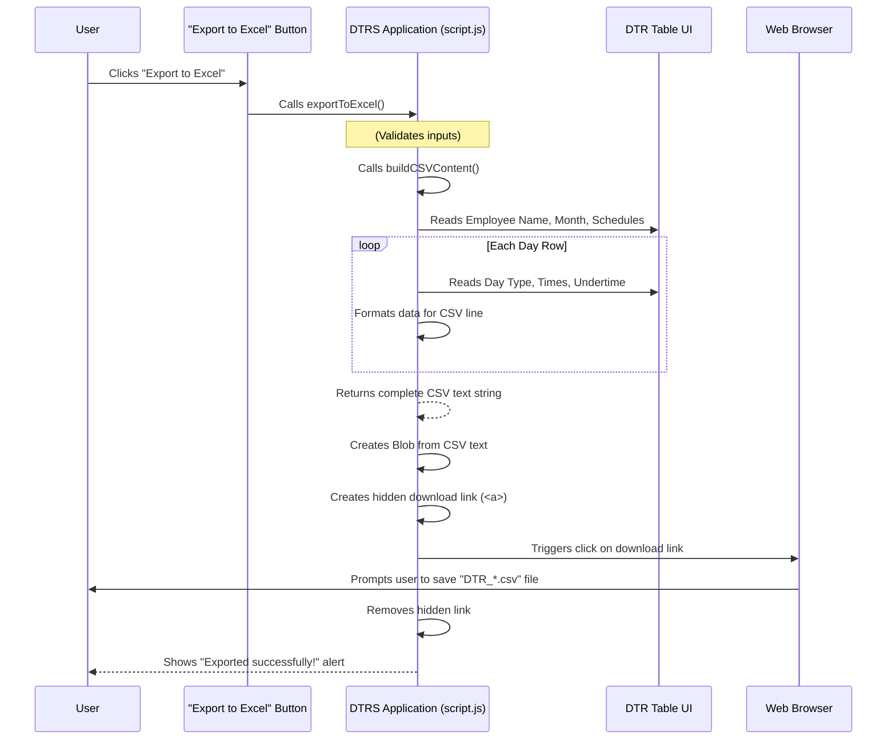
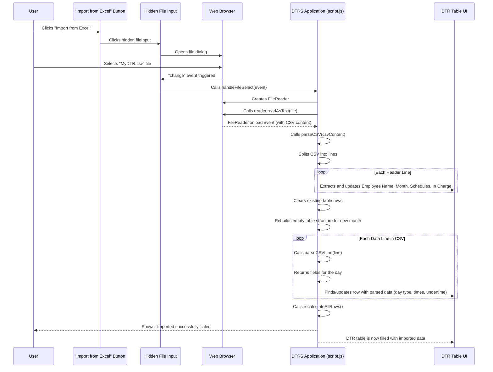

# Chapter 6: File Input/Output (CSV)

In [Chapter 5: DTR Report Generation & Preview](05_dtr_report_generation___preview_.md), we learned how to generate a perfectly formatted, print-ready DTR report from all your carefully entered data. You can now proudly print and submit your monthly records. But what if you don't finish your DTR in one go? What if you want to save your work, close the browser, and come back to it later? Or what if you want to share your DTR data with someone else, or keep a backup on your computer?

Currently, all the data you enter into the `DTRS` application (your name, times, schedules) lives only in your browser's memory. If you close the tab, all that information vanishes! This is where **File Input/Output (CSV)** comes to the rescue.

Think of it like having a digital file cabinet for your DTRs. This feature allows you to:
*   **Save your work**: Export your current DTR data as a file (like taking a picture of your work and putting it in a folder).
*   **Load previous work**: Import a saved DTR file back into the system (like pulling a file from the cabinet to continue working on it).
*   **Keep backups**: Have local copies of your records on your computer.
*   **Share data**: Easily move your DTR data between different computers or with colleagues, all without needing online server storage.

The `DTRS` project uses a special type of file called **CSV (Comma Separated Values)** for this. CSV files are like simple spreadsheets that almost any program can understand, making your data super portable!

## Use Case: Saving and Loading Your DTR

Let's say you've filled out half of your DTR for the month. You want to save it, go for a break, and come back later.
1.  You'll click an "Export" button to save your current work as a CSV file (e.g., `MyDTR_October2023.csv`).
2.  Later, you'll open the `DTRS` application again (which starts empty).
3.  You'll click an "Import" button, select your `MyDTR_October2023.csv` file, and magically, all your previously entered data will reappear in the table!

## What is a CSV File? (The "Simple Spreadsheet" Concept)

A CSV file is a plain text file where each line represents a "row" of data, and values within that row are separated by commas. It's incredibly simple and widely used because it's easy for both humans and computers to read.

Here's an example of what a tiny part of your DTR data might look like inside a CSV file:

```
Employee Name:,Jane Doe
Month/Year:,October 2023
Day,Type,AM Arrival,AM Departure,PM Arrival,PM Departure,Undertime Hours,Undertime Minutes
1,normal,08:00 AM,12:00 PM,01:00 PM,05:00 PM,0,0
2,holiday,"Christmas Day",,,,,,
3,normal,08:05 AM,12:00 PM,01:00 PM,05:00 PM,0,5
```

Notice how:
*   Each line is a new record or a new piece of information.
*   Commas separate different pieces of information on the same line.
*   Sometimes, if a piece of information (like "Christmas Day, Public Holiday") contains a comma, it's enclosed in `"` quotation marks.

Now, let's see how `DTRS` helps you work with these files.

## UI: Exporting and Importing Your DTR

In the `DTRS` application, you'll find dedicated buttons for this functionality:

*   **Export to Excel**: This button actually saves your data as a CSV file, which Microsoft Excel (and other spreadsheet programs) can easily open and understand.
*   **Import from Excel**: This button lets you select a previously saved CSV file and load its data back into the application.
*   **Hidden File Input**: There's also a special, hidden `<input type="file">` element. This is what the "Import" button secretly uses to let you browse for files on your computer.

**Example Buttons (from `index.html`):**

```html
<button id="importButton" type="button">Import from Excel</button>
<button id="saveButton" type="button">Export to Excel</button>
<input type="file" id="fileInput" accept=".csv,text/csv" style="display: none;" />
```

When you click "Export to Excel", `DTRS` gathers all your data, puts it into the CSV format, and your browser downloads it as a `.csv` file. When you click "Import from Excel", `DTRS` asks your browser to show a file selection window, you pick a `.csv` file, and `DTRS` reads its content to fill the form.

## Under the Hood: Exporting Your DTR to CSV

When you click the "Export to Excel" button, the `DTRS` application does two main things:
1.  **Builds the CSV Content**: It collects all the data from the form and structures it as a long text string in CSV format.
2.  **Triggers Download**: It takes this CSV text and tells your browser to save it as a file on your computer.

Let's look at the functions involved.

### 1. Building the CSV Content: `buildCSVContent()`

The `buildCSVContent()` function is like a diligent secretary who goes through your entire DTR, notes down every detail, and then neatly types it all out in the CSV format.

**What `buildCSVContent()` Does:**
*   It starts by adding header information like your name and the month.
*   Then, it adds the column headers for the daily entries (Day, Type, AM Arrival, etc.).
*   It loops through each day in your DTR table.
*   For each day, it extracts the day number, day type, all the time entries, and undertime hours/minutes.
*   It formats these values and joins them with commas to create a CSV line for that day.
*   Special handling for non-working days (holidays, weekends) is included to show just the day type.
*   Finally, it adds the "In Charge" name at the bottom.

**Simplified Code for `buildCSVContent()` (from `script.js`):**

```javascript
function buildCSVContent() {
  const employeeNameValue = employeeName.value.trim(); // Get name
  const monthYearDisplay = formatMonthYear(reportMonth.value); // Get month
  const inChargeNameValue = inChargeName.value.trim(); // Get in-charge name

  let csvContent = '';

  // Add general information
  csvContent += `Employee Name:,${employeeNameValue}\n`;
  csvContent += `Month/Year:,${monthYearDisplay}\n`;
  csvContent += `Official Regular Schedule:,${formatScheduleDisplay(officialHoursRegularStart.value) || ''}\n`;
  csvContent += `Official Saturday Schedule:,${formatScheduleDisplay(officialHoursSatStart.value) || ''}\n`;
  csvContent += `In Charge Name:,${inChargeNameValue}\n\n`;

  // Add header row for daily entries
  csvContent += `Day,Type,AM Arrival,AM Departure,PM Arrival,PM Departure,Undertime Hours,Undertime Minutes\n`;

  // Loop through each row in the DTR table
  const tableRows = Array.from(dataEntryTableBody.querySelectorAll('tr'));
  tableRows.forEach(row => {
    const day = parseInt(row.querySelector('[data-field="dayNumber"]').textContent);
    const dayType = row.querySelector('[data-field="dayType"]').value;
    const amArrival = row.querySelector('[data-field="amArrival"]').value;
    // ... (other time and undertime fields) ...

    let formattedDayType = dayType;
    if (dayType === 'holiday') {
      formattedDayType = getHolidayName(day) || 'HOLIDAY'; // From Chapter 4
    } else {
      formattedDayType = dayType.toUpperCase();
    }

    const quote = (str) => str.includes(',') ? `"${str}"` : str; // Handle commas

    if (dayType === 'holiday' || dayType === 'weekend' || dayType === 'restday') {
      csvContent += `${day},${quote(formattedDayType)},,,,,,,\n`; // Empty time fields
    } else {
      // Format times using formatTimePickerValue from Chapter 3
      csvContent += `${day},${quote(formattedDayType)},${formatTimePickerValue(amArrival)},${formatTimePickerValue(amDeparture)},${formatTimePickerValue(pmArrival)},${formatTimePickerValue(pmDeparture)},${underTimeHours},${underTimeMinutes}\n`;
    }
  });

  return csvContent; // Return the full CSV text string
}
```
**Explanation:**
1.  The function starts by collecting header information like `employeeName` and `monthYear`. It uses `formatMonthYear` and `formatScheduleDisplay` (from [Chapter 3: Time and Schedule Processing](03_time_and_schedule_processing_.md)) to ensure the display text matches what's expected for import.
2.  It then prepares the main column headers for the daily entries.
3.  The `forEach` loop goes through each row of the DTR table.
4.  For each day, it pulls out all the relevant data.
5.  It checks the `dayType` and uses `getHolidayName` (from [Chapter 4: Holiday Integration](04_holiday_integration_.md)) to get the proper holiday name if applicable.
6.  The `quote` helper ensures that if any value contains a comma (like "Christmas Day, Public Holiday"), it's wrapped in double quotes in the CSV, which is standard.
7.  For non-working days, it simplifies the CSV line to just the day and its type, leaving other time fields empty.
8.  For working days, it includes all formatted time entries using `formatTimePickerValue` (from [Chapter 3: Time and Schedule Processing](03_time_and_schedule_processing_.md)).
9.  Each constructed line is added to `csvContent`, followed by a newline (`\n`).
10. Finally, the complete `csvContent` string is returned.

### 2. Triggering the Download: `exportToExcel()`

Once `buildCSVContent()` provides the full CSV text, `exportToExcel()` handles the actual saving of the file to your computer.

**What `exportToExcel()` Does:**
*   It performs a quick check to make sure essential fields like "Employee Name" and "Month/Year" are filled before exporting.
*   It calls `buildCSVContent()` to get the CSV data.
*   It creates a special "blob" object, which is like a small package containing the CSV text and telling the browser it's a `text/csv` file.
*   It then creates a temporary hidden link (`<a>` tag), sets its `href` to point to this "blob" package, and gives it a `download` filename (e.g., `DTR_Jane_Doe_October_2023.csv`).
*   It "clicks" this hidden link automatically, triggering your browser's download prompt.
*   After downloading, it quickly cleans up the temporary link.

**Simplified Code for `exportToExcel()` (from `script.js`):**

```javascript
function exportToExcel() {
  const employeeNameValue = employeeName.value.trim();
  const reportMonthValue = reportMonth.value;

  // Basic validation
  if (!employeeNameValue || !reportMonthValue) {
    alert('Please fill in Employee Name and Month/Year before exporting.');
    return;
  }
  if (!officialHoursRegularStart.value) { // Check schedule as well
    alert('Please set the Official hours for Regular days before exporting.');
    return;
  }

  const csvContent = buildCSVContent(); // Get the CSV data

  // Create a Blob (a file-like object) from the CSV content
  const blob = new Blob([csvContent], { type: 'text/csv;charset=utf-8' });

  // Create a temporary link element
  const link = document.createElement('a');
  const url = URL.createObjectURL(blob); // Create a URL for the blob

  // Set the link's attributes for download
  link.href = url;
  // Create a user-friendly filename (replace spaces with underscores)
  link.download = `DTR_${employeeNameValue.replace(/\s+/g, '_')}_${formatMonthYear(reportMonthValue).replace(/\s+/g, '_')}.csv`;

  // Append link to body, click it, then remove it
  document.body.appendChild(link);
  link.click();
  document.body.removeChild(link);
  alert('DTR exported successfully!');
}
```
**Explanation:**
1.  The function performs validation.
2.  `buildCSVContent()` is called to get the CSV text.
3.  `new Blob(...)` creates a binary object (our CSV file data).
4.  A temporary `<a>` element is created, and its `href` is set to a special URL that points to our `blob`.
5.  `link.download` provides the suggested filename. `replace(/\s+/g, '_')` makes sure spaces in the name and month become underscores for a clean filename.
6.  `link.click()` simulates a user clicking the download link.
7.  The link is then removed from the document using `removeChild`.
8.  An alert confirms success.

### Exporting Process Overview



## Under the Hood: Importing Your DTR from CSV

When you click the "Import from Excel" button, `DTRS` orchestrates a reverse process:
1.  **Select File**: It asks your browser to let you select a `.csv` file.
2.  **Read File Content**: It reads the entire text content of the selected file.
3.  **Parse CSV**: It analyzes the CSV text, line by line, to extract all the DTR data.
4.  **Update UI**: It uses the extracted data to fill in all the input fields and rebuild the DTR table.

Let's look at the functions involved.

### 1. Selecting and Reading the File: `importFromExcel()` and `handleFileSelect()`

The `importFromExcel()` function initiates the file selection, and `handleFileSelect()` actually processes the chosen file.

**What `importFromExcel()` Does:**
*   It "clicks" the hidden `<input type="file" id="fileInput">` element, which opens your computer's file browser.

**Simplified Code for `importFromExcel()` (from `script.js`):**

```javascript
async function importFromExcel() {
  // This simulates a user clicking the hidden file input element.
  // When a file is selected, handleFileSelect will be called.
  fileInput.click();
}
```

When you select a file using the file dialog, the `fileInput` element triggers a `change` event, which calls `handleFileSelect()`.

**What `handleFileSelect()` Does:**
*   It gets the selected file from the event.
*   It creates a `FileReader` object, which is a built-in browser tool for reading file contents.
*   It sets up a special `onload` function for the `FileReader`. This function will be called *after* the file has been completely read.
*   It tells the `FileReader` to `readAsText()` the selected file.

**Simplified Code for `handleFileSelect()` (from `script.js`):**

```javascript
function handleFileSelect(event) {
  const file = event.target.files[0]; // Get the first selected file

  if (!file) return; // No file selected

  const reader = new FileReader(); // Create a file reader

  reader.onload = function(e) {
    try {
      parseCSV(e.target.result); // Call parseCSV with the file content
      alert('DTR imported successfully!');
    } catch (error) {
      alert('Error parsing CSV file: ' + error.message);
    }
    fileInput.value = ''; // Reset file input to allow selecting same file again
  };

  reader.readAsText(file); // Start reading the file as text
}
```
**Explanation:**
1.  `event.target.files[0]` gets the actual file object.
2.  `new FileReader()` creates an object that can read local files.
3.  `reader.onload = function(e) { ... }` defines what happens when the file is finished reading. The `e.target.result` will contain the entire CSV content as a string.
4.  Inside `onload`, `parseCSV()` is called with this content.
5.  `reader.readAsText(file)` starts the reading process.

### 2. Parsing the CSV Content: `parseCSV()` and `parseCSVLine()`

The `parseCSV()` function is the brain of the import process. It takes the raw CSV text and carefully extracts all the structured data. It relies on a helper, `parseCSVLine()`, to break down each individual line.

**What `parseCSV()` Does:**
*   It splits the entire CSV content into individual lines.
*   It identifies specific lines containing "Employee Name:", "Month/Year:", etc., and extracts those values to fill the main input fields.
*   It looks for the header row of the daily entries ("Day,Type,AM Arrival...") to know where the actual daily data begins.
*   It clears the existing DTR table.
*   It then loops through each data line, uses `parseCSVLine()` to break it into individual fields, and then updates the corresponding input fields in the DTR table.
*   It uses `convertTo24Hour()` to make sure times are correctly formatted for the HTML time inputs.
*   It uses `findScheduleValueByDisplay()` to correctly set the `<select>` options for official schedules.

**Simplified Code for `parseCSV()` (from `script.js`):**

```javascript
function parseCSV(csvContent) {
  const lines = csvContent.split(/\r?\n/).filter(line => line.trim()); // Split by newline, remove empty lines

  let dataRowsStart = -1;
  const parsedDailyEntries = [];

  // Iterate lines to find general info and data start
  lines.forEach((line, index) => {
    if (line.startsWith('Employee Name:,')) {
      employeeName.value = line.replace('Employee Name:,', '').trim();
    } else if (line.startsWith('Month/Year:,')) {
      const monthYearStr = line.replace('Month/Year:,', '').trim();
      const date = new Date(monthYearStr + ' 1'); // Need a day for valid date
      if (!isNaN(date)) reportMonth.value = `${date.getFullYear()}-${pad(date.getMonth() + 1)}`; // From Chapter 3
    } else if (line.startsWith('Official Regular Schedule:,')) {
      const display = line.replace('Official Regular Schedule:,', '').trim();
      officialHoursRegularStart.value = findScheduleValueByDisplay(display, officialHoursRegularStart);
    } else if (line.startsWith('Day,Type,AM Arrival,')) { // Found data table header
      dataRowsStart = index + 1; // Data rows start after this line
    }
    // ... (logic for other header fields like Official Saturday Schedule, In Charge Name) ...
  });

  // Collect daily entry data from detected start
  if (dataRowsStart !== -1) {
    for (let i = dataRowsStart; i < lines.length; i++) {
      const line = lines[i];
      if (line.startsWith('Summary:')) break; // Stop at summary
      if (!line.trim()) continue; // Skip empty lines

      const fields = parseCSVLine(line); // Use helper to parse complex CSV line

      if (fields.length >= 8 && parseInt(fields[0]) >= 1) { // Basic validation
        parsedDailyEntries.push({
          day: parseInt(fields[0]),
          type: fields[1].replace(/"/g, ''),
          amArrival: fields[2].replace(/"/g, ''),
          amDeparture: fields[3].replace(/"/g, ''),
          // ... (other time and undertime fields) ...
        });
      }
    }
  }

  dataEntryTableBody.innerHTML = ''; // Clear existing rows
  const daysInMonth = getDaysInMonth(reportMonth.value); // Re-generate based on selected month (Chapter 1)

  for (let dayNum = 1; dayNum <= daysInMonth; dayNum++) {
    const newRow = createRow(dayNum); // Create a fresh row for the day (Chapter 1)
    const entry = parsedDailyEntries.find(e => e.day === dayNum); // Find matching data

    if (entry) {
      // Update the fields in the newly created row
      newRow.querySelector('[data-field="dayType"]').value = entry.type;
      newRow.querySelector('[data-field="amArrival"]').value = convertTo24Hour(entry.amArrival);
      newRow.querySelector('[data-field="amDeparture"]').value = convertTo24Hour(entry.amDeparture);
      // ... (other time and undertime fields) ...
    }
    dataEntryTableBody.appendChild(newRow); // Add the updated row to the table
  }

  recalculateAllRows(); // Trigger all calculations (Chapter 1)
  officialHoursRegularStart.dispatchEvent(new Event('change')); // Update lunch note
}
```
**Explanation:**
1.  `csvContent` is split into `lines`.
2.  The code iterates through initial lines to find and populate general information (`employeeName`, `reportMonth`, `officialSchedules`).
    *   For `reportMonth`, it parses "October 2023" into a `Date` object and then formats it to "YYYY-MM" for the `<input type="month">`.
    *   For schedules, it uses `findScheduleValueByDisplay` to find the correct `value` for the `<select>` options.
3.  It finds where the daily data starts (after the `Day,Type,...` header).
4.  It then iterates through the actual data rows. For each row, `parseCSVLine()` is used to safely split it into `fields`.
5.  These fields are stored in `parsedDailyEntries`.
6.  The existing DTR table is cleared (`dataEntryTableBody.innerHTML = '';`).
7.  `getDaysInMonth(reportMonth.value)` and `createRow(dayNum)` (both from [Chapter 1: Dynamic DTR Table & Row Management](01_dynamic_dtr_table___row_management_.md)) are used to rebuild a fresh, empty table structure for the selected month. This ensures holidays/weekends are correctly applied for the selected month *even if the CSV didn't contain them*.
8.  For each new row, it tries to find a matching `entry` from `parsedDailyEntries`. If found, it populates the row's input fields.
    *   `convertTo24Hour(entry.amArrival)` is essential here to convert "08:00 AM" back to "08:00" for the `<input type="time">` elements.
9.  Finally, `recalculateAllRows()` is called to trigger all the automatic undertime calculations, and `change` events are dispatched for schedules to update the lunch notes.

### Handling Tricky CSV Lines: `parseCSVLine()`

CSV files can be tricky because a comma within a field (like "Christmas Day, Public Holiday") might be mistaken as a field separator. CSV standards use double quotes to enclose such fields. `parseCSVLine()` handles this correctly.

**What `parseCSVLine()` Does:**
*   It goes through the line character by character.
*   It keeps track if it's currently "inside" a quoted field.
*   If it encounters a comma *outside* a quoted field, it knows it's a separator and collects the field.
*   If it encounters a double quote, it toggles its "inside a quote" status.

**Simplified Code for `parseCSVLine()` (from `script.js`):**

```javascript
function parseCSVLine(line) {
  const fields = [];
  let currentField = '';
  let inQuotes = false;

  for (let i = 0; i < line.length; i++) {
    const char = line[i];

    if (char === '"') {
      inQuotes = !inQuotes; // Toggle quote status
    } else if (char === ',' && !inQuotes) {
      fields.push(currentField); // Found a separator outside quotes
      currentField = ''; // Reset for next field
    } else {
      currentField += char; // Add character to current field
    }
  }
  fields.push(currentField); // Add the last field
  return fields;
}
```
**Explanation:**
This function manually iterates through each character of the CSV line. It's like a detective checking for commas while also keeping an eye on whether it's currently inside double quotes. This ensures that a comma within a quoted phrase isn't treated as a separator.

### Time Conversion for Input: `convertTo24Hour()`

HTML `<input type="time">` elements expect time in a 24-hour format (e.g., "08:00" or "17:00"). Our CSV output uses "08:00 AM" or "05:00 PM". So, we need to convert these back.

**What `convertTo24Hour()` Does:**
*   It takes a time string like "08:00 AM" or "05:00 PM".
*   It parses the hours, minutes, and AM/PM indicator.
*   It converts 12-hour AM/PM format to 24-hour format (e.g., "05:00 PM" becomes "17:00").
*   It uses `pad()` (from [Chapter 3: Time and Schedule Processing](03_time_and_schedule_processing_.md)) to ensure two digits for hours and minutes.

**Simplified Code for `convertTo24Hour()` (from `script.js`):**

```javascript
function convertTo24Hour(timeString) {
  if (!timeString) return '';

  const match = timeString.match(/^(\d{1,2}):(\d{2})\s*(AM|PM)$/i);
  if (!match) return timeString; // If not AM/PM format, assume already 24-hour

  let [, hours, minutes, ampm] = match;
  hours = parseInt(hours);
  minutes = parseInt(minutes);
  ampm = ampm.toUpperCase();

  if (ampm === 'PM' && hours !== 12) {
    hours += 12; // Convert 1 PM to 13, 2 PM to 14, etc.
  } else if (ampm === 'AM' && hours === 12) {
    hours = 0; // 12 AM (midnight) becomes 00
  }

  return `${pad(hours)}:${pad(minutes)}`; // Format back to HH:MM (24-hour)
}
```
**Explanation:**
This function is the reverse of part of `formatTimePickerValue` (from [Chapter 3: Time and Schedule Processing](03_time_and_schedule_processing_.md)). It parses the "HH:MM AM/PM" string and adjusts the hours to a 24-hour format before returning "HH:MM".

### Matching Schedule Displays: `findScheduleValueByDisplay()`

The `officialHoursRegularStart` and `officialHoursSatStart` are `<select>` elements where each `<option>` has a display text (e.g., "8:00 AM - 5:00 PM (8 hrs + 1hr lunch)") and a hidden `value` (e.g., "08:00-17:00-60"). When importing, we only have the display text from the CSV, so we need to find the matching `value`.

**What `findScheduleValueByDisplay()` Does:**
*   It takes the display string (e.g., "8:00 AM - 5:00 PM (8 hrs + 1hr lunch)") and the `<select>` element.
*   It extracts the start and end times from the display string.
*   It then iterates through all the `<option>` elements in the given `<select>` box.
*   For each option, it calls `formatScheduleDisplay()` (from [Chapter 3: Time and Schedule Processing](03_time_and_schedule_processing_.md)) on the option's `value` to get *its* display string.
*   It compares this generated display string with the input `displayString`. If they match, it returns the option's `value`.

**Simplified Code for `findScheduleValueByDisplay()` (from `script.js`):**

```javascript
function findScheduleValueByDisplay(displayString, selectElement) {
  if (!displayString) return '';

  // Loop through all options in the select element
  for (const option of selectElement.options) {
    // formatScheduleDisplay takes a value like "08:00-17:00-60" and
    // returns "08:00 AM - 05:00 PM"
    if (formatScheduleDisplay(option.value) === displayString) {
      return option.value; // Found a match, return its value
    }
  }
  return ''; // No matching option found
}
```
**Explanation:**
This function efficiently searches through the available schedule options. It takes the text from the CSV (e.g., "8:00 AM - 5:00 PM") and compares it against the formatted display text of each option. When a match is found, it returns the internal `value` (e.g., "08:00-17:00-60") so the `<select>` element can be correctly set.

### Importing Process Overview



## Conclusion

In this chapter, we've explored the critical functionality of **File Input/Output (CSV)**. We learned how `DTRS` allows you to save your DTR data to a universally readable CSV file ("Export to Excel") and then load it back into the application ("Import from Excel") to continue working or view past records. We saw the key functions involved, from `buildCSVContent()` and `exportToExcel()` for saving, to `handleFileSelect()`, `parseCSV()`, and `parseCSVLine()` for loading, along with essential helper functions like `convertTo24Hour()` and `findScheduleValueByDisplay()`. This feature ensures that your valuable DTR data is always portable, accessible, and safely backed up on your local device.

This is the final chapter of our tutorial. You now have a comprehensive understanding of how the `DTRS` project dynamically manages tables, structures data, processes time, integrates holidays, generates reports, and handles file input/output. You're ready to master your daily time records!

---

<sub><sup>Generated by [AI Codebase Knowledge Builder](https://github.com/The-Pocket/Tutorial-Codebase-Knowledge).</sup></sub> <sub><sup>**References**: [[1]](https://github.com/nekofied143/DTRS/blob/e3a6c0dc4801d2e79c08c2b98cc6ce7241bd05b8/index.html), [[2]](https://github.com/nekofied143/DTRS/blob/e3a6c0dc4801d2e79c08c2b98cc6ce7241bd05b8/script.js)</sup></sub>
