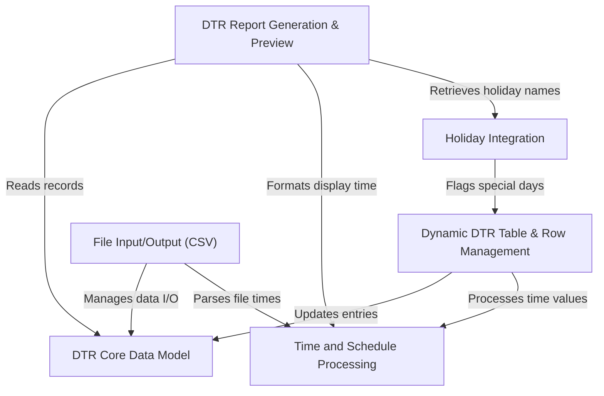

# DTRS
Civil Service Form No. 48 – Daily Time Record (DTR) is a standardized form used to record an employee’s daily attendance, including time-in and time-out for each workday. It helps track working hours, monitor punctuality, and ensure accurate payroll processing.

# Tutorial: DTRS

The DTRS project is an **offline web application** designed to help users *easily manage their daily time records (DTRs)*.
It allows you to input employee and schedule details, automatically calculate undertime based on daily attendance and holidays,
and then **generate formatted, print-ready reports**. You can also *save and load your DTR data* using CSV files, ensuring
data portability without server storage.

## Visual Overview

## Chapters

1. [Dynamic DTR Table & Row Management
](01_dynamic_dtr_table___row_management_.md)
2. [DTR Core Data Model
](02_dtr_core_data_model_.md)
3. [Time and Schedule Processing
](03_time_and_schedule_processing_.md)
4. [Holiday Integration
](04_holiday_integration_.md)
5. [DTR Report Generation & Preview
](05_dtr_report_generation___preview_.md)
6. [File Input/Output (CSV)
](06_file_input_output__csv__.md)

---

Generated by [AI Codebase Knowledge Builder](https://github.com/The-Pocket/Tutorial-Codebase-Knowledge).
